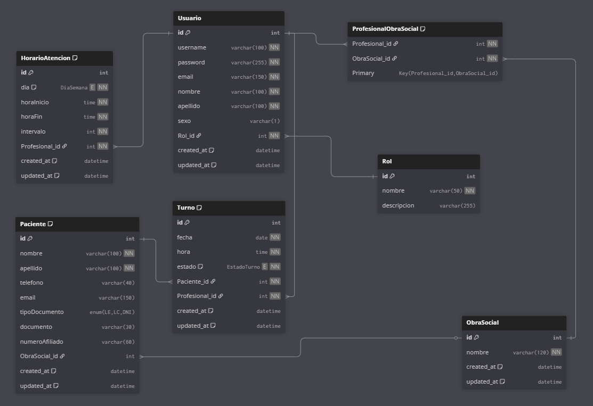

# Documentación de API - Sistema de Gestión de Turnos

## Índice
- [Diagrama de Base de Datos](#diagrama-de-base-de-datos)
- [Script de Inicialización](#script-de-inicialización)
- [Endpoints Públicos](#endpoints-públicos)
- [Endpoints Privados](#endpoints-privados-requieren-autenticación)
- [Frontend y Maquetado](#frontend-y-maquetado)
- [Códigos de Estado HTTP](#códigos-de-estado-http)
- [Autenticación](#autenticación)
- [Arquitectura de la API](#notas-sobre-la-arquitectura-de-la-api)

---

## Diagrama de Base de Datos
```markdown

```
### Estructura de la Base de Datos

El sistema utiliza **MySQL** como motor de base de datos con las siguientes entidades principales:

#### Tablas Principales

**1. `Rol`**
- Gestiona los roles del sistema (Administrador, Médico, Secretaria)
- Campos: `id`, `nombre`, `created_at`, `updated_at`

**2. `Usuario`**
- Usuarios del sistema (médicos, secretarias, administradores)
- Campos: `id`, `usuario`, `contrasena`, `email`, `nombre`, `apellido`, `sexo_biologico`, `Rol_id`
- **Relación**: Pertenece a un `Rol`
- **Soft Delete**: Utiliza `deleted_at` para eliminación lógica

**3. `ObraSocial`**
- Catálogo de obras sociales disponibles
- Campos: `id`, `nombre`, `siglas`, `rna`
- **Soft Delete**: Utiliza `deleted_at` para eliminación lógica

**4. `Paciente`**
- Información de los pacientes
- Campos: `id`, `nombre`, `apellido`, `telefono`, `email`, `tipoDocumento`, `sexo_biologico`, `documento`, `numeroAfiliado`, `ObraSocial_id`
- **Relación**: Puede tener una `ObraSocial` (opcional)
- **Soft Delete**: Utiliza `deleted_at` para eliminación lógica

**5. `HorarioAtencion`**
- Configuración de horarios de trabajo de los profesionales
- Campos: `id`, `dia`, `horaInicio`, `horaFin`, `intervalo`, `Profesional_id`
- **Relación**: Pertenece a un `Usuario` (profesional)
- **Soft Delete**: Utiliza `deleted_at` para eliminación lógica

**6. `Turno`**
- Citas/turnos médicos del sistema
- Campos: `id`, `fecha`, `hora`, `estado`, `Paciente_id`, `Profesional_id`
- **Relaciones**: Pertenece a un `Paciente` y a un `Usuario` (profesional)
- **Estados**: `Solicitado`, `Confirmado`, `En_Espera`, `Atendido`, `Cancelado`, `Ausente`
- **Soft Delete**: Utiliza `deleted_at` para eliminación lógica

**7. `ProfesionalObraSocial`**
- Tabla de relación muchos-a-muchos entre profesionales y obras sociales
- Define con qué obras sociales tiene convenio cada profesional
- Campos: `Profesional_id`, `ObraSocial_id`

### Relaciones Entre Entidades

```
Rol (1) ←--→ (N) Usuario
Usuario (1) ←--→ (N) HorarioAtencion  [como Profesional]
Usuario (1) ←--→ (N) Turno  [como Profesional]
Usuario (N) ←--→ (N) ObraSocial  [tabla ProfesionalObraSocial]

ObraSocial (1) ←--→ (N) Paciente  [opcional]
Paciente (1) ←--→ (N) Turno

Paciente (N) ←--→ (1) Usuario [a través de Turno]
```

### Características Técnicas

- **Motor**: MySQL con InnoDB
- **Codificación**: UTF8MB4 Unicode
- **Soft Delete**: Las tablas principales implementan eliminación lógica
- **Timestamps**: Todas las tablas tienen `created_at` y `updated_at` automáticos
- **Índices**: Optimizados para consultas frecuentes (nombres, documentos, fechas)
- **Restricciones**: 
  - Unique constraints en campos críticos (emails, documentos, RNAs)
  - Foreign keys con integridad referencial
  - Unique composite en `(Profesional_id, fecha, hora)` para evitar dobles turnos

---

## Script de Inicialización

El script completo de la base de datos se encuentra en:
- **Archivo**: `src/database/sql/init_schema.sql`
- **También disponible en**: `README.md` (sección "Configurar la base de datos")

### Datos Iniciales Incluidos

El script incluye datos de ejemplo para:
- **3 Roles**: Administrador, Médico, Secretaria
- **1 Usuario**: médico de ejemplo (`masuarez` / `masuarez`)
- **5 Obras Sociales**: OSDE, Swiss Medical, Galeno, OSECAC, IOMA
- **4 Pacientes**: datos de prueba
- **2 Horarios de atención**: Lunes 8:00-12:00, Martes 14:00-19:00
- **Convenios**: El médico tiene convenio con 3 obras sociales
- **4 Turnos**: ejemplos en diferentes estados

### Ejecutar el Script

```sql
-- Opción 1: Ejecutar desde MySQL Workbench o cliente gráfico
-- Abrir y ejecutar: src/database/sql/init_schema.sql

-- Opción 2: Desde línea de comandos
mysql -u tu_usuario -p < src/database/sql/init_schema.sql
```

### Configuración de Conexión

La conexión a la base de datos se configura a través de variables de entorno (`.env`):

```bash
# Configuración de Base de Datos
DB_USER="tu_usuario_mysql"
DB_PASSWORD="tu_contraseña_mysql" 
DB_DATABASE="consultorio_medico"
DB_HOST="localhost"
DB_PORT="3306"
DB_DIALECT="mysql"
```

**Archivo de configuración**: `src/database/config/config.cjs`
- Utiliza **Sequelize** como ORM
- Configuración para entornos: development, test, production
- Soporte para **MySQL2** como driver de conexión

---

## Endpoints Públicos

### Health Check
#### `GET /status`
Verifica el estado del servidor.

**Respuesta:**
```json
{
  "status": "OK"
}
```

---

### Autenticación

#### `POST /api/users/login`
Inicia sesión en el sistema.

**Body:**
```json
{
  "usuario": "string",
  "contrasena": "string"
}
```

**Respuesta exitosa (200):**
```json
{
  "message": "Inicio de sesión exitoso",
  "user": {
    "id": "number",
    "nombre": "string",
    "apellido": "string",
    "email": "string",
    "Rol_id": "number"
  },
  "token": "string"
}
```

**Cookies establecidas:**
- `username`
- `id`
- `token`
- `usuario`
- `nombre`
- `apellido`

#### `POST /api/users/logout`
Cierra la sesión del usuario autenticado.

**Respuesta exitosa (200):**
```json
{
  "message": "Sesión cerrada exitosamente"
}
```

**Efectos:**
- Destruye la sesión del servidor
- Limpia las cookies del cliente

---

### Obras Sociales

#### `GET /api/obras-sociales`
Obtiene todas las obras sociales con paginación.

**Query Parameters:**
- `page` (opcional): Número de página
- `limit` (opcional): Cantidad de resultados por página

**Respuesta exitosa (200):**
```json
{
  "message": "Obras sociales obtenidas exitosamente",
  "obrasSociales": [
    {
      "id": "number",
      "nombre": "string",
      "siglas": "string",
      "rna": "string"
    }
  ]
}
```

#### `GET /api/obras-sociales/:id`
Obtiene una obra social específica por ID.

**Parámetros de ruta:**
- `id`: ID de la obra social

**Respuesta exitosa (200):**
```json
{
  "message": "Obra social obtenida exitosamente",
  "obraSocial": {
    "id": "number",
    "nombre": "string",
    "siglas": "string",
    "rna": "string"
  }
}
```

---

### Horarios de Atención

#### `GET /api/horarios-atencion`
Obtiene todos los horarios de atención disponibles.

**Respuesta exitosa (200):**
```json
{
  "message": "Horarios de atención obtenidos exitosamente",
  "horarios": [
    {
      "id": "number",
      "dia": "string (Lunes|Martes|Miércoles|Jueves|Viernes|Sábado)",
      "horaInicio": "string (HH:MM:SS)",
      "horaFin": "string (HH:MM:SS)",
      "intervalo": "number (minutos)",
      "Profesional_id": "number",
      "created_at": "2025-11-28T15:56:28.000Z",
      "updated_at": "2025-11-28T15:56:28.000Z",
      "deleted_at": null,
      "profesional": {
        "id": "number",
        "nombre": "string",
        "apellido": "string",
        "email": "string"
      }
    }
  ]
}
```

#### `GET /api/horarios-atencion/:id`
Obtiene un horario de atención específico por ID.

**Parámetros de ruta:**
- `id`: ID del horario de atención

**Respuesta exitosa (200):**
```json
{
  "message": "Horario de atención obtenido exitosamente",
  "horario": {
    "id": "number",
    "dia": "string (Lunes|Martes|Miércoles|Jueves|Viernes|Sábado)",
    "horaInicio": "string (HH:MM:SS)",
    "horaFin": "string (HH:MM:SS)",
    "intervalo": "number (minutos)",
    "Profesional_id": "number",
    "created_at": "2025-11-28T15:56:28.000Z",
    "updated_at": "2025-11-28T15:56:28.000Z",
    "deleted_at": null,
    "profesional": {
      "id": "number",
      "nombre": "string",
      "apellido": "string",
      "email": "string"
    }
  }
}
```

#### `GET /api/horarios-atencion/:id/slots-disponibles`
Calcula los slots de tiempo disponibles para un horario de atención en una fecha específica.

**Parámetros de ruta:**
- `id`: ID del horario de atención

**Query Parameters:**
- `fecha`: Fecha para calcular disponibilidad (YYYY-MM-DD) - **Requerido**

**Ejemplo de request:**
```
GET /api/horarios-atencion/1/slots-disponibles?fecha=2024-12-15
```

**Respuesta exitosa (200):**
```json
{
  "message": "Slots calculados exitosamente",
  "slots": [
    "09:00:00",
    "09:30:00",
    "10:00:00",
    "10:30:00",
    "11:00:00"
  ]
}
```

**Nota:** Los slots se calculan basándose en `horaInicio`, `horaFin` e `intervalo` del horario, excluyendo los turnos ya ocupados para ese profesional en esa fecha.

---

### Turnos

#### `POST /api/turnos/create`
Crea un nuevo turno. Busca o crea el paciente automáticamente usando el documento.

**Body:**
```json
{
  "fecha": "string (YYYY-MM-DD)",
  "hora": "string (HH:MM:SS)",
  "Profesional_id": "number",
  "paciente": {
    "tipoDocumento": "string (LE|LC|DNI)",
    "documento": "string",
    "apellido": "string",
    "nombre": "string",
    "telefono": "string (opcional)",
    "email": "string (opcional)",
    "sexo_biologico": "string (Masculino|Femenino)",
    "numeroAfiliado": "string (opcional)",
    "ObraSocial_id": "number (opcional)"
  }
}
```

**Respuesta exitosa (201):**
```json
{
  "message": "Turno creado exitosamente",
  "turno": {
    "id": "number",
    "fecha": "string",
    "hora": "string",
    "estado": "Solicitado",
    "Profesional_id": "number",
    "Paciente_id": "number"
  }
}
```

---

## Endpoints Privados (Requieren Autenticación)

> **Nota:** Todos estos endpoints requieren estar autenticado. Se debe incluir las cookies de sesión o el token en las peticiones.

---

### Usuarios

#### `GET /api/users`
Obtiene todos los usuarios del sistema.

**Query Parameters (opcionales):**
- Filtros según validación

**Respuesta exitosa (200):**
```json
{
  "message": "Usuarios obtenidos exitosamente",
  "users": [
    {
      "id": "number",
      "usuario": "string",
      "nombre": "string",
      "apellido": "string",
      "email": "string",
      "sexo_biologico": "string (Masculino|Femenino)",
      "Rol_id": "number"
    }
  ]
}
```

#### `POST /api/users/create`
Crea un nuevo usuario en el sistema.

**Body:**
```json
{
  "usuario": "string",
  "contrasena": "string",
  "email": "string",
  "nombre": "string",
  "apellido": "string",
  "sexo_biologico": "string (Masculino|Femenino)",
  "Rol_id": "number"
}
```

**Respuesta exitosa (201):**
```json
{
  "message": "Usuario creado exitosamente",
  "user": {
    "id": "number",
    "usuario": "string",
    "nombre": "string",
    "apellido": "string",
    "email": "string",
    "sexo_biologico": "string",
    "Rol_id": "number"
  }
}
```

---

### Pacientes

#### `GET /api/pacientes`
Obtiene todos los pacientes registrados.

**Respuesta exitosa (200):**
```json
{
  "message": "Pacientes obtenidos exitosamente",
  "pacientes": [
    {
      "id": "number",
      "tipoDocumento": "string (LE|LC|DNI)",
      "documento": "string",
      "nombre": "string",
      "apellido": "string",
      "sexo_biologico": "string (Masculino|Femenino)",
      "email": "string",
      "telefono": "string",
      "numeroAfiliado": "string",
      "ObraSocial_id": "number"
    }
  ]
}
```

#### `GET /api/pacientes/:id`
Obtiene un paciente específico por ID.

**Parámetros de ruta:**
- `id`: ID del paciente

**Respuesta exitosa (200):**
```json
{
  "message": "Paciente obtenido exitosamente",
  "paciente": {
    "id": "number",
    "tipoDocumento": "string (LE|LC|DNI)",
    "documento": "string",
    "nombre": "string",
    "apellido": "string",
    "sexo_biologico": "string (Masculino|Femenino)",
    "email": "string",
    "telefono": "string",
    "numeroAfiliado": "string",
    "ObraSocial_id": "number"
  }
}
```

#### `POST /api/pacientes/create`
Crea un nuevo paciente.

**Body:**
```json
{
  "tipoDocumento": "string (LE|LC|DNI, opcional)",
  "documento": "string (opcional)",
  "nombre": "string",
  "apellido": "string",
  "sexo_biologico": "string (Masculino|Femenino)",
  "email": "string (opcional)",
  "telefono": "string (opcional)",
  "numeroAfiliado": "string (opcional)",
  "ObraSocial_id": "number (opcional)"
}
```

**Respuesta exitosa (201):**
```json
{
  "message": "Paciente creado exitosamente",
  "paciente": {
    "id": "number",
    "tipoDocumento": "string",
    "documento": "string",
    "nombre": "string",
    "apellido": "string",
    "sexo_biologico": "string",
    "email": "string",
    "telefono": "string",
    "numeroAfiliado": "string",
    "ObraSocial_id": "number"
  }
}
```

#### `PUT /api/pacientes/:id`
Actualiza un paciente existente.

**Parámetros de ruta:**
- `id`: ID del paciente

**Body (todos los campos opcionales):**
```json
{
  "tipoDocumento": "string (LE|LC|DNI)",
  "documento": "string",
  "nombre": "string",
  "apellido": "string",
  "sexo_biologico": "string (Masculino|Femenino)",
  "email": "string",
  "telefono": "string",
  "numeroAfiliado": "string",
  "ObraSocial_id": "number"
}
```

**Respuesta exitosa (200):**
```json
{
  "message": "Paciente actualizado exitosamente",
  "paciente": {
    "id": "number",
    "tipoDocumento": "string",
    "documento": "string",
    "nombre": "string",
    "apellido": "string",
    "sexo_biologico": "string",
    "email": "string",
    "telefono": "string",
    "numeroAfiliado": "string",
    "ObraSocial_id": "number"
  }
}
```

#### `DELETE /api/pacientes/:id`
Elimina un paciente (soft delete).

**Parámetros de ruta:**
- `id`: ID del paciente

**Respuesta exitosa (200):**
```json
{
  "message": "Paciente eliminado exitosamente"
}
```

---

### Turnos (Gestión Administrativa)

#### `GET /api/turnos`
Obtiene todos los turnos con filtros opcionales.

**Query Parameters (opcionales):**
- `offset`: Desplazamiento para paginación (default: 0)
- `limit`: Cantidad de resultados (default: 10)
- `fecha`: Filtrar por fecha (YYYY-MM-DD)
- `Profesional_id`: Filtrar por ID de profesional
- `Paciente_id`: Filtrar por ID de paciente
- `estado`: Filtrar por estado (Solicitado, Confirmado, En_Espera, Atendido, Cancelado)

**Respuesta exitosa (200):**
```json
{
  "message": "Turnos obtenidos exitosamente",
  "turnos": [
    {
      "id": "number",
      "fecha": "string",
      "hora": "string",
      "estado": "string",
      "Profesional_id": "number",
      "Paciente_id": "number",
      "Paciente": {
        "id": "number",
        "nombre": "string",
        "apellido": "string",
        "documento": "string"
      },
      "Profesional": {
        "id": "number",
        "nombre": "string",
        "apellido": "string"
      }
    }
  ],
  "total": "number",
  "offset": "number",
  "limit": "number"
}
```

#### `GET /api/turnos/:id`
Obtiene un turno específico por ID con toda su información relacionada.

**Parámetros de ruta:**
- `id`: ID del turno

**Respuesta exitosa (200):**
```json
{
  "message": "Turno obtenido exitosamente",
  "turno": {
    "id": "number",
    "fecha": "string",
    "hora": "string",
    "estado": "string",
    "Profesional_id": "number",
    "Paciente_id": "number",
    "Paciente": {},
    "Profesional": {}
  }
}
```

#### `PUT /api/turnos/:id`
Actualiza un turno existente (fecha, hora o estado).

**Parámetros de ruta:**
- `id`: ID del turno

**Body (campos opcionales):**
```json
{
  "fecha": "string (YYYY-MM-DD)",
  "hora": "string (HH:MM:SS)",
  "estado": "string (Solicitado|Confirmado|En_Espera|Atendido|Cancelado)"
}
```

**Respuesta exitosa (200):**
```json
{
  "message": "Turno actualizado exitosamente",
  "turno": {
    "id": "number",
    "fecha": "string",
    "hora": "string",
    "estado": "string"
  }
}
```

#### `DELETE /api/turnos/:id`
Elimina un turno (soft delete).

**Parámetros de ruta:**
- `id`: ID del turno

**Respuesta exitosa (200):**
```json
{
  "message": "Turno eliminado exitosamente"
}
```

#### `POST /api/turnos/:id/cancelar`
Cancela un turno (cambia estado a Cancelado).

**Parámetros de ruta:**
- `id`: ID del turno

**Respuesta exitosa (200):**
```json
{
  "message": "Turno cancelado exitosamente",
  "turno": {
    "id": "number",
    "estado": "Cancelado"
  }
}
```

---

### Obras Sociales (Gestión Administrativa)

#### `POST /api/obras-sociales/create`
Crea una nueva obra social.

**Body:**
```json
{
  "nombre": "string",
  "siglas": "string",
  "rna": "string"
}
```

**Respuesta exitosa (201):**
```json
{
  "message": "Obra social creada exitosamente",
  "obraSocial": {
    "id": "number",
    "nombre": "string",
    "siglas": "string",
    "rna": "string"
  }
}
```

#### `PUT /api/obras-sociales/:id`
Actualiza una obra social existente.

**Parámetros de ruta:**
- `id`: ID de la obra social

**Body (campos opcionales):**
```json
{
  "nombre": "string",
  "siglas": "string",
  "rna": "string"
}
```

**Respuesta exitosa (200):**
```json
{
  "message": "Obra social actualizada exitosamente",
  "obraSocial": {
    "id": "number",
    "nombre": "string",
    "siglas": "string",
    "rna": "string"
  }
}
```

#### `DELETE /api/obras-sociales/:id`
Elimina una obra social.

**Parámetros de ruta:**
- `id`: ID de la obra social

**Respuesta exitosa (200):**
```json
{
  "message": "Obra social eliminada exitosamente"
}
```

---

### Horarios de Atención (Gestión Administrativa)

#### `POST /api/horarios-atencion`
Crea un nuevo horario de atención.

**Body:**
```json
{
  "dia": "string (Lunes|Martes|Miércoles|Jueves|Viernes|Sábado)",
  "horaInicio": "string (HH:MM:SS)",
  "horaFin": "string (HH:MM:SS)",
  "intervalo": "number (minutos entre turnos)",
  "Profesional_id": "number"
}
```

**Respuesta exitosa (201):**
```json
{
  "message": "Horario de atención creado exitosamente",
  "horario": {
    "id": "number",
    "dia": "string",
    "horaInicio": "string",
    "horaFin": "string",
    "intervalo": "number",
    "Profesional_id": "number"
  }
}
```

#### `PUT /api/horarios-atencion/:id`
Actualiza un horario de atención existente.

**Parámetros de ruta:**
- `id`: ID del horario de atención

**Body (campos opcionales):**
```json
{
  "dia": "string (Lunes|Martes|Miércoles|Jueves|Viernes|Sábado)",
  "horaInicio": "string (HH:MM:SS)",
  "horaFin": "string (HH:MM:SS)",
  "intervalo": "number (minutos entre turnos)",
  "Profesional_id": "number"
}
```

**Respuesta exitosa (200):**
```json
{
  "message": "Horario de atención actualizado exitosamente",
  "horario": {
    "id": "number",
    "dia": "string",
    "horaInicio": "string",
    "horaFin": "string",
    "intervalo": "number",
    "Profesional_id": "number"
  }
}
```

#### `DELETE /api/horarios-atencion/:id`
Elimina un horario de atención (soft delete).

**Parámetros de ruta:**
- `id`: ID del horario de atención

**Respuesta exitosa (200):**
```json
{
  "message": "Horario de atención eliminado exitosamente"
}
```

---

## Notas sobre la Arquitectura de la API

### Contexto del Proyecto
Este es un proyecto académico enfocado en la implementación de operaciones CRUD (Create, Read, Update, Delete) para un sistema de gestión de turnos médicos.

### Decisiones de Diseño

**Endpoints Públicos:**
- Los endpoints públicos permiten a los pacientes acceder a información básica y crear turnos sin necesidad de autenticación.
- La creación de turnos incluye lógica para buscar o crear pacientes automáticamente usando el documento como identificador único.

**Endpoints Privados:**
- Requieren autenticación mediante sesión (cookies).
- Permiten la gestión administrativa completa del sistema.
- Incluyen operaciones CRUD sobre todas las entidades del sistema.

**Sistema de Autenticación:**
- Basado en sesiones con Express Session.
- Las cookies se establecen después del login exitoso.
- El middleware `isLogged` protege los endpoints administrativos.

### Funcionalidades Principales

1. **Gestión de Turnos:**
   - Creación pública para pacientes.
   - Gestión completa (lectura, actualización, cancelación) para personal administrativo.

2. **Gestión de Pacientes:**
   - CRUD completo restringido al personal autorizado.
   - Creación automática al sacar turno si no existe.

3. **Configuración del Sistema:**
   - Horarios de atención configurable por profesional.
   - Catálogo de obras sociales.
   - Gestión de usuarios del sistema.

4. **Consultas Públicas:**
   - Disponibilidad de horarios.
   - Listado de obras sociales.
   - Cálculo de slots disponibles.

---

## Códigos de Estado HTTP

- `200 OK` - Solicitud exitosa
- `201 Created` - Recurso creado exitosamente
- `400 Bad Request` - Error en la validación de datos
- `401 Unauthorized` - No autenticado
- `403 Forbidden` - No autorizado
- `404 Not Found` - Recurso no encontrado
- `500 Internal Server Error` - Error del servidor

---

## Autenticación

La autenticación se realiza mediante sesiones y cookies. Después de un login exitoso:

1. Se establece `req.session.auth` con los datos del usuario
2. Se establecen cookies con información del usuario
3. El middleware `isLogged` verifica la sesión en cada request a endpoints privados

**Cookies de sesión:**
- `username`
- `id`
- `token`
- `usuario`
- `nombre`
- `apellido`

Estas cookies deben incluirse en las peticiones a endpoints privados.

---

## Frontend y Maquetado

### Arquitectura del Sistema
**Este proyecto utiliza una arquitectura separada frontend-backend:**

- **📁 Backend (este repositorio)**: [tp_uade_back_appi](https://github.com/GeorgessDavid/tp_uade_back_appi)
  - API REST con Node.js + Express + TypeScript
- **📁 Frontend (repositorio separado)**: [tp_uade_front_appi](https://github.com/GeorgessDavid/tp_uade_front_appi)
  - Interfaz de usuario conectada a esta API
- **🗄️ Base de Datos**: MySQL

### Tecnología Backend
- **Runtime**: Node.js + TypeScript
- **Framework**: Express.js
- **ORM**: Sequelize
- **Base de Datos**: MySQL
- **Autenticación**: Express Session + Cookies
- **API**: RESTful JSON

### Integración Frontend-Backend
La API está configurada para comunicarse con el frontend a través de:

#### CORS (Cross-Origin Resource Sharing)
```typescript
// Configuración en index.ts
app.use(cors({
    origin: process.env.FRONT_END_URL?.split(','),
    credentials: true,
    methods: ['GET', 'POST', 'PUT', 'DELETE', 'OPTIONS'],
    allowedHeaders: ['Authorization', 'Content-Type']
}))
```

#### Variables de Entorno para Integración
Configurar en `.env`:
```bash
# URL(s) del frontend para CORS (separar múltiples con comas)
FRONT_END_URL="http://localhost:5173,http://localhost:3000"

# Dominio para cookies compartidas
DOMAIN="localhost"
```

#### Autenticación Cross-Domain
- **Cookies de sesión** compartidas entre frontend y backend
- **Session management** con Express Session
- **CSRF protection** mediante configuración de cookies

### Características de la Comunicación
✅ **Peticiones CORS autorizadas** desde el frontend especificado  
✅ **Cookies de autenticación** compartidas entre dominios  
✅ **Respuestas JSON** estandarizadas  
✅ **Manejo de errores** consistente  
✅ **Validación de datos** en el backend

### Configuración para Desarrollo Local

**1. Configurar Backend (este repositorio):**
```bash
# Clonar y configurar backend
git clone https://github.com/GeorgessDavid/tp_uade_back_appi.git
cd tp_uade_back_appi
pnpm install
# Configurar .env con FRONT_END_URL="http://localhost:5173"
pnpm dev
```

**2. Configurar Frontend:**
```bash
# Clonar frontend en directorio separado
git clone https://github.com/GeorgessDavid/tp_uade_front_appi.git
cd tp_uade_front_appi
# Seguir instrucciones del README del frontend
```

**3. Verificar Integración:**
- Backend ejecutándose en: `http://localhost:3001`
- Frontend ejecutándose en: `http://localhost:5173` (o puerto configurado)
- Verificar que `FRONT_END_URL` en el backend coincida con la URL del frontend

---

*Última actualización: 28 de noviembre de 2025*
